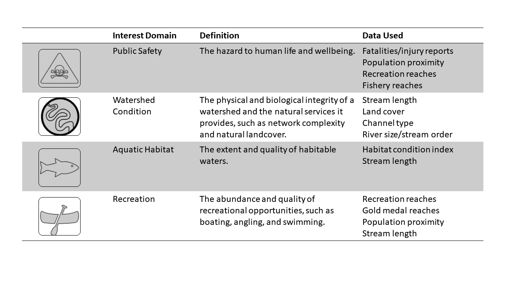
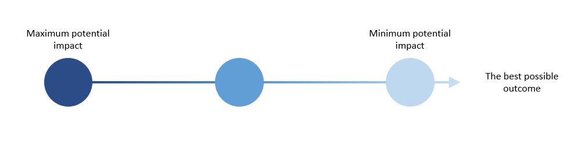
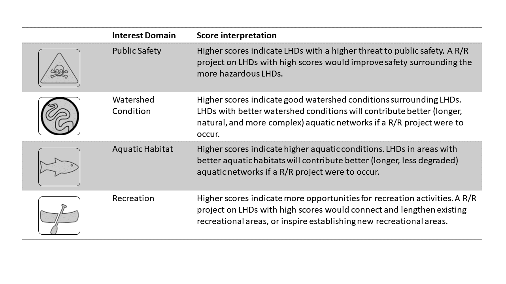

```{r setup, include = FALSE}
# Shiny & Flexdashboard libraries
library(shiny)
library(flexdashboard)
library(dplyr)
library(tidyr)
library(leaflet)
library(sf)
# library(rgdal)
library(RColorBrewer)
library(viridisLite)
library(DT)
# library(knitr)
library(ggplot2)
library(plotly)
library(shinyBS)
library(htmltools)
library(knitr)
# library(shinyjs)
# library(flextable)
# library(reactable)

# knitr::opts_chunk$set(echo = FALSE, ft_max_row = 6, tab.topcaption=FALSE, ft.align="left")

source('utils.R')
```

<style>
.navbar, [data-toggle=tab], .navbar-brand  {   background-color:#1c3a5d;   border-color:black;   color:white; }

.navbar-logo img {
    position: absolute;
    right: 6px;
}

</style>


```{r context="server"}
# LHD Points and scores, wide format
score_pts   <- readRDS("data/app_data/lhd_score_pts.rds")

# LHD Scores in wide and long format, no geometry 
score       <- readRDS("data/app_data/lhd_score.rds")
score_norm  <- readRDS("data/app_data/lhd_score_normal.rds") %>% 
  dplyr::select(-score) %>% 
  dplyr::rename(score = score_std)

# score_rank_pts    <-  readRDS("data/app_data/lhd_score_normal_pts.rds")
# score_pts    <-  readRDS("data/app_data/lhd_score_normal_pts_wide.rds") 

score_tidy  <- readRDS("data/app_data/lhd_score_tidy.rds")

cat_lst       <- c("aquatic_health", "watershed_cond", "public_health", "recreation")
clean_cat_lst <- c("Aquatic Health","Watershed Condition", "Public Safety", "Recreation")

# water rights tab
output$lhdMap          <- renderLeaflet({ basemap(pts = score_pts) })

# output$tableMap        <- renderLeaflet({ 
#   tablemap(pts = dplyr::filter(score_pts, new_id %in% c(top_rank()$ID))) 
#            })
```
Intro
=================================================

#### About this project

A total of 1,103 low-head dams in Colorado have been inventoried and documented on an interactive public map ([Colorado Low Head Dam Inventory](https://dnr.colorado.gov/initiatives/colorado-low-head-dams)). Several of these low-head dams (LHDs) have a clear economic utility, serving agricultural, mining, and/or industrial needs. However, many of these low-head dams also pose a public safety hazard, disrupt recreational opportunities, are rendered obsolete, and disturb the continuity and function of aquatic ecosystems and associated ecosystem services. A major challenge facing decision makers is identifying which low-head dams are ripe for retrofitting or removal (R/R). In order to aid this decision-making process, a quantitative framework for prioritizing low-head dams must be developed. Such a framework must account for the multi-sector costs and benefits of project investment, and do-so at-scale such that all 1,103 existing low-head dams can be evaluated.

#### Impact categories

A literature review and stakeholder surveys revealed six general categories of stakeholder interests when considering an LHD removal: public safety; watershed condition; aquatic habitat; recreation; industrial utility; and financial, management, and institutional considerations. Of these interest domains, the first four (public safety, watershed condition, aquatic habitat, and recreation) are well suited for broad-scale quantitative analysis, allowing first-order estimates of project impact. However, the final two domains – Industrial Utility; and Finance, Management, and Institutional Considerations - are inherently project specific, data-limited, and too difficult to generalize at a state-wide scale. For this reason, our framework only includes four of these six major interest domains, acknowledging that industrial utility, financial, managerial, and institutional considerations need to be accounted for on a project-by-project basis. 

Decisions regarding what considerations will represent the remaining four interest domains are influenced by data availability. For instance, water quality, while an important aspect of aquatic habitat, is not measured uniformly across the state in a way that can be evaluated at every LHD site. 
The interest domains considered in the framework, each category’s definition, and the data used to quantify each are illustrated below.

```{r category defs, echo = FALSE, out.width = '100%'}
# 

```

#### Prioritization framework 

Here, we present a framework for prioritizing LHD R/R projects that aims to synthesize the costs and benefits of project investment across a range of stakeholder interests. The framework assesses the **maximum potential impact** of an LHD removal or retrofit project across various interest domains. 

```{r potential impact, echo = FALSE,  out.width = '100%'}
# 

```

---

**Potential impact describes the relative gain in value stemming from an LHD R/R project, as evaluated across a single or all interest domains.**

An interest domain receiving a high score (largest blue circle) indicates certain conditions where R/R would have the greatest potential impact. This means that the capital invested in implementing the project would be put to good use, in terms of stimulating beneficial outcomes. An interest domain receiving a low score (smallest blue circle) indicates conditions where a R/R would do little to push the needle toward a maximum future value/state. A suite of data-driven quantitative metrics underlies the scoring system. Score interpretations for each interest domain is summarized in the table below. 

```{r score interp, echo = FALSE, out.width = '100%'}
# 

```

#### How to use the dashboard

This dashboard is an interactive tool that displays each inventoried low head dam and its scores across all interest domains. Explore summaries of the inventory using the maps, data table, or plots. Manipulate how composite scores are calculated to reflect preferences on domain importance.

**Scoring tab**

*Use this tab if you want to view one (or a few) LHDs and their score breakdown, including the LHD’s position among all other LHDs’ scores.*

1.	Use the left-hand panel to determine which interest domains you wish to include in the analysis and how each interest domain is weighted in the total score. 

2.	Select an LHD on the map to view the score breakdown for each interest domain. You may also select an LHD by clicking on a point in the Rank plot, on the bottom right, or by typing in an LHD ID number in the text box.


**Ranking tab**

*Use this tab if you want to view a list of top LHD scores, ranked by total score or by one of the interest domains.*

1.	Use the left-hand panel to determine which interest domains you wish to include in the analysis and how each interest domain is weighted in the total score. For example, if you want to view only the top 25 public safety LHDs, uncheck the other interest domain boxes. 

2.	The data table shows the low head dams with the top 25 total scores, according to the selections in the left-hand panel. Select the rows to view their locations in the map.

***Proceed to the next tabs to access dashboard***

#### Detailed Quantitative Methods

Quantitative metrics provide actionable information to assist in R/R projects. Some of the methods we use to quantify LHD structures have been vetted and used in existing analytical frameworks (Lacy, 2020; SARP, 2022). We build on these individual frameworks and quantitatively assess project potential in each interest domain using appropriate data. For more detailed information about the analysis methods, please see the [source code repository](https://github.com/rachel-lynker/lhd_analysis) for this project.

The public safety interest domain is quantified by the level of danger an LHD structure presents to humans. Our evaluation of public safety impact is based on three core concepts: 1) historical incident reports, 2) the potential for dangerous submerged hydraulic jumps to manifest near the structure, and 3) the proximity of the structure to major population centers and popular recreational reaches. Historical incident reports of known injuries and fatalities at LHDs provide direct evidence of LHD danger. The presence and persistence of submerged hydraulic jumps, which can entrain humans and cause drowning or serious injury, are evaluated using structural categorizations and attributes and satellite imagery of the structures. The proximity of an LHD to a population center or popular recreational reach help us understand the likelihood that humans are in contact with the structure and its intrinsic dangers. Population proximity may be evaluated using U.S. census data and rudimentary geospatial analysis techniques, and recreational reaches are determined by American Whitewater reaches and Colorado Parks and Wildlife fishing locations. 

River network connectivity is a core concept underlying our proposed approaches for evaluating project impact to watershed quality, aquatic habitat and recreation. River network connectivity refers to the network of interconnected waterways (and their attributes) between structural breakpoints. Delineating connected networks adjacent to LHDs can be done with the National Hydrography Dataset (NHDPlus), which provides a high-resolution mapping of the U.S. river and stream network (U.S. Geological Survey, 2019). Using graph analysis computational techniques, we can identify the extent of connected river networks as they exist now and as they may be in the future following R/R project investment. For example, consider the river network in Figure 3A with three LHDs situated along the mainstem. In this network, LHD 2 acts as a connectivity barrier dividing the black network (between LHD 3 and 2) and the gray network (between LHD 2 and 1). If LHD 2 were to be removed, as is shown in Figure 3B, the newly connected area, shown in green, is the sum of the previously divided gray and black networks. The potentially connected network extent in Figure 3B provides a domain extent for subsequent analyses of geomorphic, ecological, hydrological, and recreational attributes of constituent river segments.

```{r connectivity, echo = FALSE,  out.width = '100%'}
# 
knitr::include_graphics("data/app_data/connectivity.png")
```

---

**A segmented river network showing LHDs 1, 2, and 3; B) total connected river network in green between LHD 1 and LHD 3 if LHD 2 were removed**

Watershed condition describes the physical and biological integrity of the watershed. Our evaluation of watershed condition impact is based on four main concepts: 1) network connectivity, as described previously, 2) network complexity, 3) natural landcover, and 4) channel alteration, all of which have been adapted from the Aquatic Barrier Prioritization Tool (SARP, 2022). The diversity of stream order within the connected network measures the level of complexity in the watershed. A more complex network allows for a greater range of habitat and species. Network complexity is evaluated using the NHDPlus network by assigning segments to class sizes based on total drainage area. Watershed condition is also influenced by the amount of natural land cover in the watershed, as LHDs surrounded by fewer impervious surfaces are more likely to contribute to higher quality habitat if a R/R were to occur. Natural land cover is derived from the USDA National Landcover Database (NCLD) and measured from the overall percent of natural land cover throughout the entire connected network. Lastly, channel alteration is a measure of how altered a waterway is compared to natural conditions. Highly channelized reaches have a lower variety and quality of instream habitat. We evaluate channel alteration by identifying reach segments coded as canals or ditches in the NHDPlus HR dataset, and then calculating the percent of altered lengths by the total length of the connected network. 

Aquatic biota is a prime indicator of overall stream health (Herman and Nejadhashemi, 2015). Thus, the extent of quality habitable waters for endangered species, trout, and other aquatic biota in Colorado waters is an important consideration in LHD R/R projects. To evaluate the aquatic habitat interest domain, we propose the following considerations: 1) network connectivity, as described above, and 2) cumulative habitat condition indices (HCI). Habitat condition indices exist for every river reach in the coterminous United States, and measure aquatic habitat quality while considering human disturbances and the natural landscape. We quantify aquatic habitat condition by averaging HCI scores for every river segment upstream of each LHD. 

The recreation interest domain quantifies the abundance of quality recreational opportunities. In addition to network connectivity, which would allow for uninterrupted boat passage, we also evaluate this interest domain by considering the proximity of LHDs to river access points and existing popular recreation reaches (whitewater stretches and gold medal waters), as well as to a town or city center. Successful whitewater parks built within the last 30 years are often built near population centers who regularly seek them out. Therefore, this domain may be evaluated simply by proximity to recreational reaches (such as documented American Whitewater segments and the Colorado Parks and Wildlife Gold Medal Fishing waters) and State of Colorado municipal boundaries.  

In order to compare an LHD’s potential impact to another, we synthesize the individual impact scores into a composite, total score. Interest domains can be weighted more or less in a composite score, based on user institutional or structural knowledge about the LHD of interest. An evaluation of the net impacts of a portfolio of LHDs can give decision makers the ability to identify groups of LHDs that may not receive high impact scores individually, but could approach a maximum future value if all underwent a R/R project. This scenario is conceivable when there are multiple LHDs close to each other on a single stretch of river, and removing all of them could significantly increase network connectivity and the potential impact across all interest domains.

#### Data Considerations and Limitations

This framework and dashboard are decision support tools, not decision makers. Capital investment decisions are situationally unique and multifactorial. The framework is surely unable to quantitatively capture all of the considerations behind any one project. However, the framework does offer a generalizable platform for comparing and contrasting many potential projects across the state that may be useful in the process of investment triage. In other words, the framework provides a mechanism to identify a short (or long-short) list of projects that warrant deeper consideration. 

The Colorado LHD Inventory contained structure category designations Diversion Dam, Grade Control Structures, and Recreation. While all Recreation dams were confirmed and removed from the analysis, it must be noted that a thorough investigation of the remaining two categories, Diversion Dam and Grade Control Structure was not done. The Colorado LHD Inventory identified Diversion Dams as the most dangerous, as they are most likely built with a vertical face that can create a submerged hydraulic jump. A cursory pass through of some LHDs found some mis-categorization some LHDs between the first two categories, with some Grade Control Structures mislabeled as Diversion Dams and vise versa. Therefore, scoring an LHD based on this categorization would have been misleading, potentially lowering the score of a dangerous LHD. Further work correctly categorizing LHDs based on submerged hydraulic jump potential should be completed.

Certain data limitations exist that prevent some factors of an interest domain to be fully quantified. Therefore, each domain is quantified based on best available state-wide data that best represents each consideration. For instance, some aquatic measurements of biotic health, such as species richness and presence of invasive species, are not comprehensive enough to adequately include in the framework. Therefore, institutional knowledge of known invasive or endangered species should be considered in concert with the prioritization scoring framework.

#### References

Aquatic Barrier Prioritization Tool. (2020). *Southeast Aquatic Resources Partnership.* https://connectivity.sarpdata.com/

Herman, M. R., & Nejadhashemi, A. P. (2015). A review of macroinvertebrate-and fish-based stream health indices. *Ecohydrology & Hydrobiology, 15*(2), 53-67.

Lacy, S.W. (2020). *INTRODUCING A CALIFORNIA LOW-HEAD DAM INVENTORY METHODOLOGY.* [Unpublished Master's Thesis]. University of California Berkley. http://riverlab.berkeley.edu/wp/wp-content/uploads/Spencer-Lacy-Capstone_-California-Low-Head-Dams.pdf

U.S. Geological Survey. (2019). National Hydrogophy Dataset. (Ver. USGS National Hydrography Dataset High Resolution (NHD) for Hydrologic Unit (HU) 4  (Published 20191002). https://www.usgs.gov/national-hydrography/access-national-hydrography-products

Zimmer, S. (2019). Colorado Low Head Dam Inventory Project. *University of Colorado, Denver.* https://drive.google.com/file/d/12ZIjQ-4kRxg8ni9ecTHq5dc-DjxdVLkq/view


Scoring
=================================================
Input {.sidebar}
------------------------------------------------------------
### **Directions:**

1. Select a low head dam on the map or use the search field below to view scores. 
<br>
2. Use the options below to manipulate how the total score is calculated

```{r}
# Select/search for LHD IDs
# shiny::selectInput(
#   "selectLHD",
#   "Search for LHD...",
#   unique(score_tidy$new_id),
#   multiple = TRUE
#   )

shiny::selectizeInput(
  inputId  = "selected_locations",
  label    = "Search",
  # choices  = nc$NAME,
  choices  = unique(score_norm$new_id),
  selected = NULL,
  multiple = TRUE
  )
# poverty_sidebar <- sidebarPanel(
shiny::checkboxGroupInput(
    inputId  = "scoreButtons",
    label    = "Interest domains",
    choices  = c(
              "Public Safety"        = "public_health",
              "Recreation"           = "recreation",
              "Watershed Condition"  = "watershed_cond",
              "Aquatic Health"       = "aquatic_health"
              ),
        selected = c("public_health", "recreation",  "watershed_cond", "aquatic_health")
    # selected = c("aquatic_health", "watershed_cond", "public_health", "recreation")
    )

# Score Weight input
shiny::numericInput(
  inputId = "phWeight",
  label   = "Public Safety weight:",
  value   = 1,
  min     = 0,
  max     = 20
  )

# Score Weight input
shiny::numericInput(
  inputId = "recWeight",
  label   = "Recreation weight:",
  value   = 1,
  min     = 0,
  max     = 20
  )

# Score Weight input
shiny::numericInput(
  inputId = "wsWeight",
  label   = "Watershed condition weight:",
  value   = 1,
  min     = 0,
  max     = 20
  )

# Score Weight input
shiny::numericInput(
  inputId = "ahWeight",
  label   = "Aquatic Health weight:",
  value   = 1,
  min     = 0,
  max     = 20
  )

# Reset inputs button UI
shiny::actionButton("reset_input", "Reset inputs")

shiny::verbatimTextOutput("idText")
shiny::verbatimTextOutput("changeText")

```

```{r context="server"}
# ---- Reset inputs button ----

# Observe clicking of reset button
shiny::observeEvent(input$reset_input, {
  
  # Reset selected points
  shiny::updateSelectizeInput(
    session,
    inputId  = "selected_locations",
    label    = "Search",
    choices  = unique(score_norm$new_id),
    selected = NULL
    )
  
  # Reset check boxes
  shiny::updateCheckboxGroupInput(
    inputId  = "scoreButtons",
    label    = "Interest domains",
    choices  = c(
              "Aquatic Health"       = "aquatic_health",
              "Watershed Condition"  = "watershed_cond",
              "Public Safety"        = "public_health",
              "Recreation"           = "recreation"
              ),
    selected = c("public_health", "recreation",  "watershed_cond", "aquatic_health")
    # selected = c("aquatic_health", "watershed_cond", "public_health", "recreation")
    )
  
  # Reset Public safety weight
  shiny::updateNumericInput(
    inputId = "phWeight",
    label   = "Public Safety weight:",
    value   = 1,
    min     = 0,
    max     = 20
    )

  # Reset Recreation  weight
  shiny::updateNumericInput(
    inputId = "recWeight",
    label   = "Recreation weight:",
    value   = 1,
    min     = 0,
    max     = 20
    )
  
  # Reset Watershed condition weight
  shiny::updateNumericInput(
    inputId = "wsWeight",
    label   = "Watershed condition weight:",
    value   = 1,
    min     = 0,
    max     = 20
  )
  
  # Reset Aquatic health  weight
  shiny::updateNumericInput(
    inputId = "ahWeight",
    label   = "Aquatic Health weight:",
    value   = 1,
    min     = 0,
    max     = 20
    )
})

```


```{r context="server"}
# ---- Reactive values ----

# LHD ID reactive value
score_buttons <- shiny::reactive({
  
  print("score_buttons reactive")
  input$scoreButtons
})

# LHD ID reactive value
# lhd_id <- shiny::reactive({ print("lhd_id reactive") input$lhdMap_marker_click$id })

# lhd_scores <- shiny::reactive({
#   score_norm %>%
#     dplyr::filter(new_id %in% input$selected_locations) %>%
#     dplyr::filter(category %in% input$scoreButtons)
#   })

category_weights <- shiny::reactive({
    shiny::req(input$ahWeight)
    shiny::req(input$wsWeight)
    shiny::req(input$phWeight)
    shiny::req(input$recWeight)
    # shiny::req(input$selected_locations)
    
    print("category_weights reactive")
    
    weights_df <-
      data.frame(
        category = c("Aquatic Health", "Watershed Condition", "Public Safety", "Recreation"),
        # weights  = c(1, 2, 1, 3)
        # weights  = c(1, 1, 1, 1)
        weights  = c(input$ahWeight, input$wsWeight, input$phWeight, input$recWeight)
      ) %>%
      replace(is.na(.), 0)

    # is.na(weights_df$weights) <- 0

    # paste(input$ahWeight, input$wsWeight, input$phWeight, input$recWeight)
})

# Mean total scores dataframe
mean_scores <- shiny::reactive({
  # shiny::req(input$selected_locations)
  shiny::req(input$scoreButtons)
  shiny::req(category_weights())
  
  print("mean_scores reactive")
  
  df <-
    score_norm %>%
    dplyr::filter(new_id %in% input$selected_locations) %>%
    dplyr::filter(category %in% input$scoreButtons) %>%
    # dplyr::filter(new_id %in% c(1, 156, 484, 784, 5, 9, 7)) %>%
    # dplyr::filter(category %in% c("aquatic_health", "recreation", "watershed_cond","public_health")) %>%
    dplyr::group_by(clean_cat_id) %>%
    dplyr::summarize(mean_score = mean(score, na.rm = T)) %>%
    dplyr::ungroup()

  empty_score <- tibble::tibble(
    clean_cat_id = clean_cat_lst[!clean_cat_lst %in% unique(df$clean_cat_id)]
  ) %>%
    dplyr::mutate(mean_score = 0)

  # bind rows with missing category and calculate percent of total score
  df_mean <-
    df %>%
    dplyr::bind_rows(empty_score) %>%
    dplyr::left_join(
      category_weights(),
      # weights_df,
      by = c("clean_cat_id" = "category")
      ) %>%
    dplyr::mutate(mean_score = mean_score*weights) %>%
    dplyr::mutate(
      Percent = 100*(mean_score/sum(mean_score))
    ) %>%
    dplyr::mutate(across(where(is.numeric), round, 2 )) %>%
    dplyr::mutate(
      # clean_cat_id = factor(clean_cat_id, levels = c("Aquatic Health", "Watershed Condition", "Public Safety", "Recreation")),
      clean_cat_id = factor(clean_cat_id, levels = c("Recreation", "Public Safety",
                                                     "Watershed Condition", "Aquatic Health")),
      Percent          = case_when(
        is.nan(Percent) ~ 0,
        TRUE        ~ Percent
        )
      )
    df_mean
    })

# Reactive mean score values
ahScore <- shiny::reactive({
    shiny::req(mean_scores())
    dplyr::filter(mean_scores(), clean_cat_id == "Aquatic Health")$mean_score
})

wsScore <- shiny::reactive({
    shiny::req(mean_scores())
    print("wsScore reactive")
    dplyr::filter(mean_scores(), clean_cat_id == "Watershed Condition")$mean_score
})

recScore <- shiny::reactive({
    shiny::req(mean_scores())
     print("recScore reactive")
    dplyr::filter(mean_scores(), clean_cat_id == "Recreation")$mean_score
  
})

phScore <- shiny::reactive({
    shiny::req(mean_scores())
    print("phScore reactive")
    dplyr::filter(mean_scores(), clean_cat_id == "Public Safety")$mean_score
      
})

# Reactive total score value
totalScore <- shiny::reactive({
   shiny::req(mean_scores())
    print("totalScore reactive")
  mean_scores() %>%
    dplyr::summarise(total_score = sum(mean_score, na.rm = T)) %>%
    .$total_score
    
})

rank_scores <- shiny::reactive({
    # shiny::req(input$selected_locations)
    shiny::req(input$scoreButtons)
    shiny::req(category_weights())
    
    print("rank_scores reactive")
    # Rank LHD scores and plot
    rank_df <-
      score_norm %>%
      dplyr::filter(category %in% input$scoreButtons) %>%
      # dplyr::filter(category %in% c("aquatic_health", "recreation",  "watershed_cond", "public_health")) %>%
      dplyr::left_join(
        category_weights(),
        # weights_df,
        by = c("clean_cat_id" = "category")
        ) %>%
      dplyr::mutate(score = score*weights) %>%
      dplyr::group_by(new_id, stream_name, legend) %>%
      dplyr::summarise(total_score = sum(score, na.rm = T)) %>%
      dplyr::ungroup() %>%
      dplyr::arrange(-total_score) %>%
      dplyr::mutate(rank = rank(-total_score, ties.method = "first"))  
      # dplyr::rename("ID" = "new_id") 
      # dplyr::relocate(ID, Rank, `Total Score`)
    rank_df

})

category_ranks <- shiny::reactive({
    # shiny::req(input$selected_locations)
    shiny::req(input$scoreButtons)
    shiny::req(category_weights())
    
    print("category_rank reactive")
    # Rank LHD scores and plot
    category_rank_df <- 
      score_norm %>%
      dplyr::filter(category %in% input$scoreButtons) %>%
      # dplyr::filter(category %in% c("aquatic_health", "recreation",
      #                               "watershed_cond", "public_health")) %>%
      dplyr::left_join(
        category_weights(),
        # weights_df,
        by = c("clean_cat_id" = "category")
        ) %>%
      dplyr::mutate(score = score*weights) %>%
      dplyr::mutate(across(where(is.numeric), round, 3)) %>%
      dplyr::mutate(
        clean_cat_id = factor(clean_cat_id, levels = c("Recreation", "Public Safety",
                                                       "Watershed Condition", "Aquatic Health"))) %>% 
      dplyr::rename("Score" = "score")
    category_rank_df
})

event_trigger <- shiny::reactive({
    shiny::req(input$selected_locations)
    shiny::req(input$scoreButtons)
    shiny::req(input$ahWeight)
    shiny::req(input$wsWeight)
    shiny::req(input$phWeight)
    shiny::req(input$recWeight)
    
    print("event_trigger reactive")
    
    paste(input$selected_locations, input$scoreButtons, input$ahWeight, input$wsWeight, input$phWeight, input$recWeight)
    # list(input$selected_locations,  input$scoreButtons)
  })
```

```{r context="server"}
# Test output
# output$meanLHD <- renderPrint({
#     # print(mean_scores())# print(rank_scores())
#   print(category_weights()) # print(dplyr::filter(mean_scores(), clean_cat_id == "Watershed Condition")$mean_score ) })

# # Test output
output$idText <- renderPrint({
    print(selected$groups)
    # shiny::req(category_weights())
    # print(top_rank())
    # print(event_trigger())
  })
# 
output$changeText <- renderPrint({
   print(category_ranks())
    # print(event_trigger())
    # print(event_trigger())
  })

```

Row {data-height=400}
-----------------------------------------------------------------------
###
```{r}
# LHD leaflet output
leaflet::leafletOutput("lhdMap")
```

```{r context="server"}

proxy <- leaflet::leafletProxy("lhdMap")

selected <- shiny::reactiveValues(groups = vector())

shiny::observeEvent(input$lhdMap_marker_click, {
      # print("observer1")
      if(input$lhdMap_marker_click$group == "regions") {

        selected$groups <- c(selected$groups, input$lhdMap_marker_click$id)

          proxy %>%
            leaflet::showGroup(group = input$lhdMap_marker_click$id)
          print("regions group click")

      } else {

        selected$groups <- setdiff(selected$groups, input$lhdMap_marker_click$group)

        proxy %>%
          leaflet::hideGroup(group = input$lhdMap_marker_click$group)
        print("NOT regions group click")
      }
      shiny::updateSelectizeInput(
        session,
        inputId  = "selected_locations",
        label    = "Search",
        choices  = unique(score_norm$new_id),
        selected = selected$groups
        )
    }
    )


shiny::observeEvent(input$selected_locations, {
      # print("observer2")
      # Points removed by selection input
      removed_via_selectInput <- setdiff(selected$groups, input$selected_locations)

      # Points added by selection input
      added_via_selectInput   <- setdiff(input$selected_locations, selected$groups)

      if(length(removed_via_selectInput) > 0) {

        selected$groups <- input$selected_locations

        proxy %>%
          leaflet::hideGroup(group = removed_via_selectInput)
          print("RM via selection")
      }

      if(length(added_via_selectInput) > 0){

        selected$groups <- input$selected_locations

        proxy %>%
          leaflet::showGroup(group = added_via_selectInput)
        print("ADD via selection")
      }

       # print(dplyr::filter(mean_scores(), clean_cat_id == "Watershed Condition")$mean_score )
    },
    ignoreNULL = FALSE
    )

# LHD ID value box server
# output$idBox <-  flexdashboard::renderValueBox(
#                      flexdashboard::valueBox(
#                       value = "LHD ID: ",
#                       color = "primary"
#                   )
#                 )

# Observe Leaflet map marker clicks
# Value box server
shiny::observeEvent(input$lhdMap_marker_click , {
          # print("observer3")
          click <- input$lhdMap_click %>%
              data.frame() %>%
              dplyr::select(lat,lng)

              print(click)
              # print(lhd_id())

          pt <- sf::st_as_sf(
              click,
              coords = c("lng", "lat"),
              crs = 4326
              )


         # LHD ID value box
          # output$idBox <- flexdashboard::renderValueBox(
          #   flexdashboard::valueBox(
          #     value = paste0("LHD ID: ", lhd_id()),
          #     # value = paste0("District ", district_id$district),
          #     color = "primary"
          #     )
          #   )
}
)

```

Row {data-height=100}
-----------------------------------------------------------------------
###
```{r}
# Public Safety value box output
flexdashboard::valueBoxOutput("phBox")
shinyBS::bsPopover(
  "phBox",
  title     = "Public Safety Score",
  content   = "The hazard to human life and wellbeing. Higher scores indicate LHDs with a higher threat to public safety. A removal/retrofit project on LHDs with high scores would improve safety surrounding the more hazardous LHDs.",
  placement = "left",
  options   = list(container = "body")
  )
tags$style(HTML("
                .tooltip > .tooltip-inner {
                width: 400px;
                color: black;
                background-color: white;
                }
                "))
```

###
```{r}
# Recreation value box output
flexdashboard::valueBoxOutput("recBox")
shinyBS::bsPopover(
  "recBox",
  title     = "Recreation Score",
  content   = "The abundance and quality of recreational opportunities, such as boating, angling, and swimming. Higher scores indicate more opportunities for recreation activities. A removal/retrofit project on LHDs with high scores would connect and lengthen existing recreational areas, or inspire establishing new recreational areas.",
  placement = "top",
  options   = list(container = "body")
  )
tags$style(HTML("
                .tooltip > .tooltip-inner {
                width: 400px;
                color: black;
                background-color: white;
                }
                "))
```

###
```{r}
# Watershed Condition value box output
flexdashboard::valueBoxOutput("watershedBox")
shinyBS::bsPopover(
  "watershedBox",
  title     = "Watershed Condition Score",
  content   = "The physical and biological integrity of a watershed and the natural services it provides, such as network complexity and natural landcover.Higher scores indicate good watershed conditions surrounding LHDs. LHDs with better watershed conditions will contribute better (longer, natural, and more complex) aquatic networks if a removal/retrofit project were to occur.",
  placement = "top",
  options   = list(container = "body")
  )
tags$style(HTML("
                .tooltip > .tooltip-inner {
                width: 400px;
                color: black;
                background-color: white;
                }
                "))
```

###
```{r}
# Aquatic Health value box output
flexdashboard::valueBoxOutput("ahBox")
shinyBS::bsPopover(
  "ahBox",
  title     = "Aquatic Health Score",
  content   = "The extent and quality of habitable waters. Higher scores indicate higher aquatic conditions. LHDs in areas with better aquatic habitats will contribute better (longer, less degraded) aquatic networks if a removal/retrofit project were to occur.",
  placement = "top",
  options   = list(container = "body")
  )
tags$style(HTML("
                .tooltip > .tooltip-inner {
                width: 400px;
                color: black;
                background-color: white;
                }
                "))
```

###
```{r}
# Recreation value box output
flexdashboard::valueBoxOutput("totalScoreBox")
shinyBS::bsPopover(
  "totalScoreBox",
  title     = "Total Score",
  content   = "All individual category scores summed together. Higher scores indicate a larger benefit for removal the LHD.",
  placement = "top",
  options   = list(container = "body")
  )
tags$style(HTML("
                .tooltip > .tooltip-inner {
                width: 400px;
                color: black;
                background-color: white;
                }
                "))
```


```{r}

# Public Safety value box start
output$phBox <-  flexdashboard::renderValueBox(
                     flexdashboard::valueBox(
                      value   = "-",
                 icon    = "fa-plus-circle",
                      caption = "Public Safety",
                      color   = "danger"
                  )
                )

# Public Safety value box start
output$recBox <-  flexdashboard::renderValueBox(
                     flexdashboard::valueBox(
                      value = "-",
                      icon    = "fa-swimmer",
                      caption = "Recreation",
                      color = "warning"
                  )
                )

# # Aquatic Health value box start
output$ahBox <-  flexdashboard::renderValueBox(
                     flexdashboard::valueBox(
                      value   = "-",
                      icon    = "fa-fish",
                      caption = "Aquatic Health",
                      color   = "primary"
                  )
                )

# Watershed Condition value box start
output$watershedBox <-  flexdashboard::renderValueBox(
                     flexdashboard::valueBox(
                      value   = "-",
                      icon    = "fa-tree",
                      caption = "Watershed condition",
                      color   = "success"
                  )
                )

# Total score value box start
output$totalScoreBox <-  flexdashboard::renderValueBox(
                     flexdashboard::valueBox(
                      value = "-",
                      caption = "Total Score",
                      color = "#dcdcdc"
                  )
                )

# Value box server
shiny::observeEvent(input$selected_locations, {
# shiny::observeEvent(event_trigger(), {
      # print("observer4")
  
      # Public Safety value box server
      output$phBox <- flexdashboard::renderValueBox(
        flexdashboard::valueBox(
          value = paste0(phScore()),
          icon    = "fa-plus-circle",
          caption = "Public Safety",
          color = "danger"
          )
        )
      
      # Recreation value box server
      output$recBox <- flexdashboard::renderValueBox(
        flexdashboard::valueBox(
          value = paste0(recScore()),
          icon    = "fa-swimmer",
          caption = "Recreation",
          color = "warning"
          )
        )
            # Aquatic health value box server
      output$ahBox <- flexdashboard::renderValueBox(
        flexdashboard::valueBox(
          value    = paste0(ahScore()),
              icon    = "fa-fish",
           caption = "Aquatic Health",
          color    = "primary"
          )
        )
      
      # Watershed condition value box server
      output$watershedBox <- flexdashboard::renderValueBox(
        flexdashboard::valueBox(
          value   = paste0(wsScore()),
          icon    = "fa-tree",
          caption = "Watershed condition",
          color   = "success"
          )
        )
      
      # Total score value box server
      output$totalScoreBox <- flexdashboard::renderValueBox(
        flexdashboard::valueBox(
          value   = paste0(totalScore()),
          caption = "Total Score",
          color   = "#dcdcdc"
          )
        )
}
)
```

Row {data-height=400}
-----------------------------------------------------------------------
### Score breakdown
```{r}
# plotly::plotlyOutput("meanScorePlot")
shiny::plotOutput("meanScorePlot")
shinyBS::bsPopover(
  "meanScorePlot",
  title     = "Scores by interest domain",
  content   = "This plot shows how the LHD scores in each interest domain relative to how the rest of the LHDs are scored.",
  placement = "top",
  options   = list(container = "body")
  )
tags$style(HTML("
                .tooltip > .tooltip-inner {
                width: 400px;
                color: black;
                background-color: white;
                }
                "))
```

```{r context="server"}
# Percent of total score plot server
# shiny::observeEvent(input$selected_locations, {
shiny::observeEvent(event_trigger(), {
    # print("observer5")
  output$meanScorePlot <- shiny::renderPlot({
  # output$meanScorePlot <- plotly::renderPlotly({
    # score_mean_plot(df = mean_scores(), interactive = TRUE)
      # shiny::req(category_ranks())
      # shiny::req(input$selected_locations)
      category_rank_plot(
        df           = category_ranks(), 
        lhd_ids      = selected$groups,
        # lhd_ids      = c(1, 2),
        interactive  = FALSE
        )
   
  })
 # print("observer5 v2")
  # .section level3 chart-wrapper chart-wrapper-flex {
    # flex: 100 0px; }

  # img{ # max-width:100px;
     # max-height:100px;}
})
```

### Rank
```{r}
# LHD Scoring rank plot
# shiny::plotOutput("rankPlot")
plotly::plotlyOutput("rankPlot")
shinyBS::bsPopover(
  "rankPlot",
  title     = "Ranked Scores",
  content   = "This plot shows the distribution of all total scores.The lhds with the highest score (and lowest rank) are in the top left. Hover over a point to view its ID, stream name, and structural category. You may also zoom in on the graph.",
    placement = "top",
  options   = list(container = "body")
  )
tags$style(HTML("
                .tooltip > .tooltip-inner {
                width: 400px;
                color: black;
                background-color: white;
                }
                "))
```

```{r context="server"}
shiny::observeEvent(event_trigger(), {
   # print("observer6")
  
    # Ranked LHD scores plot
    output$rankPlot <- plotly::renderPlotly({
    # output$rankPlot <- shiny::renderPlot({
      shiny::req(rank_scores())
      shiny::req(input$selected_locations)
      # Ranked LHD scores plot
      score_rank_plot(
        df          = rank_scores(),
        lhd_ids     = selected$groups,
        interactive = TRUE
        )
    })
}
#   ignoreNULL = FALSE,
# ignoreInit = TRUE
)
```

Data Table
=================================================
Input {.sidebar}
------------------------------------------------------------
### **Directions:**
1. Use the interactive data table to view top 25 low head dams
<br>
2. Use the options below to manipulate how the total score is calculated

```{r}
# Interest domain check boxes
shiny::checkboxGroupInput(
    inputId  = "scoreButtonsDT",
    label    = "Interest domains",
    choices  = c(
              "Public Safety"        = "public_health",
              "Recreation"           = "recreation",
              "Watershed Condition"  = "watershed_cond",
              "Aquatic Health"       = "aquatic_health"
              ),
      selected = c("public_health", "recreation", "watershed_cond", "aquatic_health")
    # selected = c("aquatic_health", "watershed_cond", "public_health", "recreation")
    )

# Select/search for LHD IDs
# shiny::selectizeInput(
#   inputId  = "selected_locations",
#   label    = "Search",
#   # choices  = nc$NAME,
#   choices  = unique(score_norm$new_id),
#   selected = NULL,
#   multiple = TRUE
#   )

# Score weight input
shiny::numericInput(
  inputId = "phWeightDT",
  label   = "Public Safety weight:",
  value   = 1,
  min     = 0,
  max     = 20
  )

# Score weight input
shiny::numericInput(
  inputId = "recWeightDT",
  label   = "Recreation weight:",
  value   = 1,
  min     = 0,
  max     = 20
  )

# Score weight input
shiny::numericInput(
  inputId = "wsWeightDT",
  label   = "Watershed condition weight:",
  value   = 1,
  min     = 0,
  max     = 20
  )

# Score weight input
shiny::numericInput(
  inputId = "ahWeightDT",
  label   = "Aquatic Health weight:",
  value   = 1,
  min     = 0,
  max     = 20
  )

# Reset inputs button
shiny::actionButton(
  "reset_input_dt",
  "Reset inputs"  
  )

# Reset datatable selections button
shiny::actionButton(
  "clear_rows_button",
  "Clear Table Selections"  
  )
# shiny::textOutput("scoreButtonText")
# shiny::verbatimTextOutput("meanLHD")
#
# shiny::verbatimTextOutput("idText")
# shiny::verbatimTextOutput("changeText")
```

```{r context="server"}
# Observe clicking of reset button DT
shiny::observeEvent(input$reset_input_dt, {
  
  # Reset check boxes
  shiny::updateCheckboxGroupInput(
    inputId  = "scoreButtonsDT",
    label    = "Interest domains",
    choices  = c(
              "Public Safety"        = "public_health",
              "Recreation"           = "recreation",
              "Watershed Condition"  = "watershed_cond",
              "Aquatic Health"       = "aquatic_health"
              ),
    selected = c("public_health", "recreation",  "watershed_cond", "aquatic_health")
    # selected = c("aquatic_health", "watershed_cond", "public_health", "recreation")
    )

  # Reset Public safety weight
  shiny::updateNumericInput(
    inputId = "phWeightDT",
    label   = "Public Safety weight:",
    value   = 1,
    min     = 0,
    max     = 20
    )

  # Reset Recreation  weight
  shiny::updateNumericInput(
    inputId = "recWeightDT",
    label   = "Recreation weight:",
    value   = 1,
    min     = 0,
    max     = 20
    )
  
  # Reset Watershed condition weight
  shiny::updateNumericInput(
    inputId = "wsWeightDT",
    label   = "Watershed condition weight:",
    value   = 1,
    min     = 0,
    max     = 20
  )
  
  # Reset Aquatic health  weight
  shiny::updateNumericInput(
    inputId = "ahWeightDT",
    label   = "Aquatic Health weight:",
    value   = 1,
    min     = 0,
    max     = 20
    )
})

```

```{r context="server"}
# ---- Reactive values ----
#create empty vector to hold all click ids
# selected_ids <- shiny::reactiveValues(ids = vector())

# event_trigger_dt <- shiny::reactive({
#     # shiny::req(input$selected_locations)
#     shiny::req(input$scoreButtonsDT)
#     shiny::req(input$ahWeightDT)
#     shiny::req(input$wsWeightDT)
#     shiny::req(input$phWeightDT)
#     shiny::req(input$recWeightDT)
#     shiny::req(input$scoreTable_rows_selected)
#
#     paste(input$scoreButtonsDT, input$ahWeightDT, input$wsWeightDT, input$phWeightDT, input$recWeightDT, input$scoreTable_rows_selected)
#     # paste(input$selected_locations, input$scoreButtonsDT, input$ahWeightDT, input$wsWeightDT, input$phWeightDT, input$recWeightDT)
#   })

# LHD ID reactive value
score_buttons_dt <- shiny::reactive({
  input$scoreButtonsDT
})

category_weights_dt <- shiny::reactive({
    # shiny::req(input$ahWeightDT)
    # shiny::req(input$wsWeightDT)
    # shiny::req(input$phWeightDT)
    # shiny::req(input$recWeightDT)

    weights_df <-
      data.frame(
        category = c("Aquatic Health", "Watershed Condition", "Public Safety", "Recreation"),
        # weights  = c(0, 0, 0, 0)
        # weights  = c(1, 1, 1, 1)
        weights  = c(input$ahWeightDT, input$wsWeightDT, input$phWeightDT, input$recWeightDT)
      ) %>%
      replace(is.na(.), 0)
})

category_ranks_dt <- shiny::reactive({
  
  shiny::req(score_buttons_dt())
  shiny::req(category_weights_dt())
  
  # Rank LHD scores and plot
  category_df <-
    score_norm %>%
    dplyr::filter(category %in% score_buttons_dt()) %>%
    # dplyr::filter(category %in% c("aquatic_health", "recreation",
                                  # "watershed_cond", "public_health")) %>%
    dplyr::left_join(
      category_weights_dt(),
      # weights_df,
      by = c("clean_cat_id" = "category")
      ) %>%
    dplyr::mutate(score = score*weights) %>%
    dplyr::mutate(across(where(is.numeric), round, 3)) %>%
    dplyr::mutate(
      clean_cat_id = factor(clean_cat_id, levels = c("Recreation", "Public Safety",
                                                     "Watershed Condition", "Aquatic Health")))

})


top_rank <- shiny::reactive({
    shiny::req(score_buttons_dt())
    shiny::req(category_weights_dt())
    # Top 25 LHD scores
    # top_rank <-
    score_norm %>%
        dplyr::filter(category %in% score_buttons_dt()) %>%
        # dplyr::filter(category %in% c("aquatic_health", "recreation", "watershed_cond", "public_health")) %>%
           # dplyr::filter(category %in% c()) %>%
        dplyr::left_join(
          category_weights_dt(),
          # weights_df,
          by = c("clean_cat_id" = "category")
          ) %>%
        dplyr::mutate(score = score*weights) %>%
        dplyr::group_by(new_id) %>%
        dplyr::mutate("Total Score" = sum(score, na.rm = T)) %>%
        # dplyr::select(new_id, category, clean_cat_id, score, "Total Score") %>%
        tidyr::pivot_wider(
          id_cols     = c("Total Score", new_id, stream_name, legend, lat, lng),
           # id_cols     = c("Total Score", new_id),
                           names_from  = clean_cat_id,
                           values_from = c(score)) %>%
        tidyr::pivot_longer(cols = c(-new_id, -stream_name, -legend)) %>%
        tidyr::pivot_wider(names_from = name, values_from = value) %>%
        dplyr::ungroup() %>%
        dplyr::mutate(Rank = as.integer(rank(-`Total Score`, ties.method = "first"))) %>%
            # dplyr::mutate(Rank = as.integer(rank(`Total Score`))) %>%
        # dplyr::arrange(`Total Score`) %>%
        dplyr::arrange(Rank) %>%
        dplyr::slice(1:25) %>%
        dplyr::rename(
          "ID"        = "new_id",
          "Ownership" = legend,
          "Stream"    = stream_name,
          "Latitude"  = lat,
          "Longitude" = lng
          ) %>%
        dplyr::relocate(Rank, ID, `Total Score`) %>%
            dplyr::relocate(Ownership, Stream, Latitude, Longitude, .after = last_col())
        # dplyr::relocate(`Total Score`, .after = last_col()) %>%
        # dplyr::relocate(Ownership, Stream, lat, lng, .after = last_col())

  # }
})

# # Reactive IDs text
selected_pts <- shiny::reactive({
     top_rank()[c(input$scoreTable_rows_selected),]
    })

# Rows selected in DT
# selected_rows <- shiny::reactive({
#   # c(unique(input$scoreTable_rows_selected))
#    # top_rank()[input$scoreTable_rows_selected, 2] })

# # Reactive IDs text
# selected_ids <- shiny::reactive({ top_rank()$ID[c(input$scoreTable_rows_selected)]})

# Top 25 rank points
# top_rank_pts <- shiny::reactive({
#   score_pts %>%
#     dplyr::filter(new_id %in% c(top_rank()$ID))})
#
# # points selected by DT
# selected_pts <- shiny::reactive({
#   top_rank_pts() %>%
#     dplyr::filter(new_id %in% selected_ids())
#    dplyr::filter(score_pts, new_id %in% top_rank()$ID[c(input$scoreTable_rows_selected)])})
```

Row
-----------------------------------------------------------------------
### Scores Table
```{r}
# Row {data-height=600}
# LHD leaflet output
DT::DTOutput("scoreTable")
shinyBS::bsPopover(
  "scoreTable",
  title     = "LHD Total Score Table",
  content   = "Click on different rows to highlight low head dam locations on the map. To change how the total score is calculated, use the panel to the left.",
  placement = "bottom",
  options   = list(container = "body")
  )
tags$style(HTML("
                .tooltip > .tooltip-inner {
                width: 400px;
                color: black;
                background-color: white;
                }
                "))
```

```{r context="server"}
# top 25 ranked LHD scores table
output$scoreTable <- DT::renderDT({
    DT::datatable(
      top_rank(),
      fillContainer = TRUE,
      options       = list(
        pageLength = 25,
        stateSave  = TRUE
        )
      ) %>% 
    DT::formatRound(columns = c('Latitude', 'Longitude'),  digits = 2)
  })

# # create a proxy to modify datatable without recreating it completely
DT_proxy <- DT::dataTableProxy("scoreTable")

# clear row selections when clear_rows_button is clicked
shiny::observeEvent(input$clear_rows_button, {
      DT::selectRows(DT_proxy, NULL)
      leaflet::leafletProxy("tableMap") %>%
         leaflet::clearGroup(group_name)
      
   })

# added marker group name
group_name <- "my_additons"

shiny::observeEvent(input$scoreTable_rows_selected, {

     # Selected rows
     row_selected = top_rank()[input$scoreTable_rows_selected,]

     print(row_selected)

     print("more rows selected")

     # Add clicked row markers to map as red points
     leaflet::leafletProxy('tableMap') %>%
       leaflet::clearGroup(group_name) %>%
       leaflet::addCircleMarkers(
            data         = row_selected,
            # lng          = ~lng,
            # lat          = ~lat,
            lng          = ~Longitude,
            lat          = ~Latitude,
            group        = group_name,
            # fillColor    = "red",
            radius       = 12,
            fillColor    = "black",
            fillOpacity  = 0.8,
            color        = "black",
            opacity      = 1,
            weight       = 1,
            stroke       = T
          )

     # If no rows in Datatable are selected, clear out red markers
     if(is.null(input$scoreTable_rows_selected)) {

       print("no rows selected")

       leaflet::leafletProxy('tableMap') %>%
         leaflet::clearGroup(group_name)

       }
  },
  ignoreNULL = FALSE,
  ignoreInit = TRUE
  )
```

Row
-----------------------------------------------------------------------
### Map
```{r}
# Row {data-height=400}
# LHD leaflet output
leaflet::leafletOutput("tableMap")
shinyBS::bsPopover(
  "tableMap",
  title     = "Top 25 LHDs by total score ",
  content   = "The map shows the low head dams with the top 25 total scores according to the selections in the data table and left-hand panel. The color of each LHD represents its rank by total score. The darker red colors indicate a higher rank (higher total score), while the lighter yellow colors indicate a lower rank (lower total score).",
  placement = "top",
  options   = list(container = "body")
  )
tags$style(HTML("
                .tooltip > .tooltip-inner {
                width: 400px;
                color: black;
                background-color: white;
                }
                "))
```

```{r context="server"}
output$tableMap        <- leaflet::renderLeaflet({
     tablemap(pts = top_rank())
     # tablemap(pts = top_rank)
           })
```


```{r context="server"}
# Observe Leaflet map marker clicks
# Value box server
# shiny::observeEvent(input$tableMap_marker_click , {
# 
#           click <- input$tableMap_click %>%
#               data.frame() %>%
#               dplyr::select(lat,lng)
# 
#               print(click)
#               print("map_click")
#               # print(lhd_id())
# 
#           pt <- sf::st_as_sf(
#               click,
#               coords = c("lng", "lat"),
#               crs = 4326
#           )
#           })
# shiny::observeEvent({input$scoreTable_rows_selected,
#
#   leaflet::leafletProxy("tableMap")  %>%
#       leaflet::showGroup(group = input$tableMap_marker_click$id)
#    proxy_tablemap <- leaflet::leafletProxy("tableMap")
# shiny::observeEvent({input$scoreTable_rows_selected,
#   # if(is.null(input$scoreTable_rows_selected)) {
#   #   NULL
#   #   print("is nullll")
#   # } else {
#       # Points removed by selection input
#       removed_via_dt <- setdiff(input$scoreTable_rows_selected, input$scoreTable_rows_selected)
#       # removed_via_dt <- setdiff(selected_table$groups, selected_dt())
#
#       # Points added by selection input
#       added_via_dt   <- setdiff(input$scoreTable_rows_selected, input$scoreTable_rows_selected)
#       # added_via_dt   <- setdiff(selected_dt(), selected_table$groups)
#
#       if(length(removed_via_dt) > 0) {
#
#         # selected_table$groups <- input$scoreTable_rows_selected
#         # selected_table$groups <- selected_dt()
#
#         proxy_tablemap %>%
#           leaflet::hideGroup(group = removed_via_dt)
#            print("rm via dt")
#       }
#
#       if(length(added_via_dt) > 0){
#          print("add via dt")
#         # selected_table$groups <- input$scoreTable_rows_selected
#         # selected_table$groups <- selected_dt()
#
#         proxy_tablemap %>%
#           leaflet::showGroup(group = added_via_dt)
#       }
#
#        # print(dplyr::filter(mean_scores(), clean_cat_id == "Watershed Condition")$mean_score )
#     # }
#   },
#     ignoreNULL = FALSE
#     )

# proxy_tablemap <- leaflet::leafletProxy("tableMap")
# proxy_table    <- DT::dataTableProxy("scoreTable")
# selected_table <- shiny::reactiveValues(groups = vector())
#
# shiny::observeEvent(input$tableMap_marker_click, {
#       if(input$tableMap_marker_click$group == "regions") {
#         selected_table$groups <- c(selected_table$groups, input$tableMap_marker_click$id)
#           proxy_tablemap %>%
#             leaflet::showGroup(group = input$tableMap_marker_click$id)
#       } else {
#         selected_table$groups <- setdiff(selected_table$groups, input$tableMap_marker_click$group)
#
#         proxy_tablemap %>%
#           leaflet::hideGroup(group = input$tableMap_marker_click$group)
#         # proxy_table %>%
#         #   selectRows(which(top_rank()$ID %in% input$tableMap_marker_click$id))
#       }
#         proxy_table %>%
#             selectRows(which(top_rank()$ID %in% input$tableMap_marker_click$id))
#       # shiny::updateSelectizeInput(
#       #   session, inputId  = "selected_locations", label    = "Search",
#       #   choices  = unique(score_norm$new_id),  selected = selected_table$groups)
#     })

# shiny::observeEvent(input$selected_table_locations, {
# shiny::observeEvent(input$scoreTable_rows_selected, {
#     if(is.null(input$scoreTable_rows_selected)) {
#       NULL
#       print("is nullll")
#     } else {
#        proxy_tablemap %>%
#           leaflet::hideGroup(group = input$tableMap_marker_click$group)
#       # Points removed by selection input
#       removed_via_dt <- setdiff(selected_table$groups, input$scoreTable_rows_selected)
#       # removed_via_dt <- setdiff(selected_table$groups, selected_dt())
#
#       # Points added by selection input
#       added_via_dt   <- setdiff(input$scoreTable_rows_selected, selected_table$groups)
#       # added_via_dt   <- setdiff(selected_dt(), selected_table$groups)
#
#       if(length(removed_via_dt) > 0) {
#
#         selected_table$groups <- input$scoreTable_rows_selected
#         # selected_table$groups <- selected_dt()
#
#         proxy_tablemap %>%
#           leaflet::hideGroup(group = removed_via_dt)
#            print("rm via dt")}
#       if(length(added_via_dt) > 0){
#          print("add via dt")
#         selected_table$groups <- input$scoreTable_rows_selected
#         # selected_table$groups <- selected_dt()
#         proxy_tablemap %>%
#           leaflet::showGroup(group = added_via_dt)
#       }
#     # }
#   },
#     ignoreNULL = FALSE} )
```
<!-- Row {data-height=200} -->
<!-- ----------------------------------------------------------------------- -->
<!-- ### selRowText -->
<!-- ```{r} -->
<!-- verbatimTextOutput("selRowText") -->
<!-- ``` -->

<!-- ### selTabText Text -->
<!-- ```{r} -->
<!-- verbatimTextOutput("selTableText") -->
<!-- ``` -->

<!-- ```{r context="server"} -->

<!-- output$selRowText <- renderPrint({ -->
<!--   print(score_buttons_dt()) -->
<!--   # print(selected_rows()) -->
<!--   }) -->

<!-- # Test output -->
<!-- output$selTableText <- renderPrint({ -->
<!--       # print(selected_pts()) -->
<!--   if(is.null(input$scoreTable_rows_selected)) { -->
<!--     print("no rows selected") -->
<!--   } else { -->
<!--     print(paste0("these rows are selected", input$scoreTable_rows_selected)) -->
<!--   } -->
<!--     # print(selected_table$new_id) -->
<!--   }) -->
<!-- ``` -->


